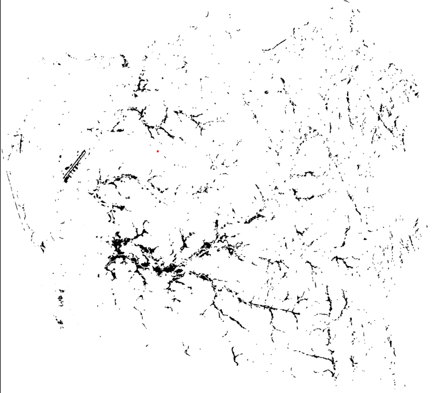
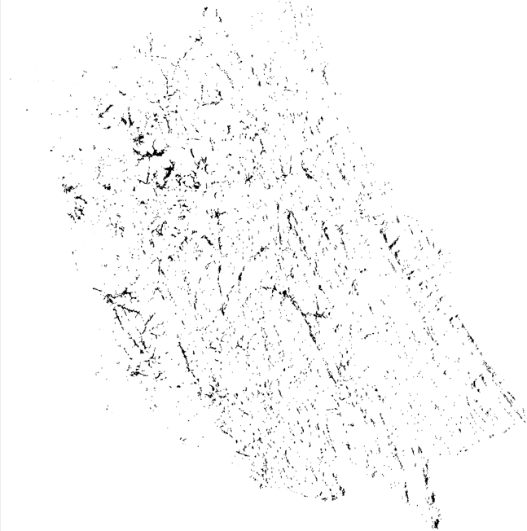
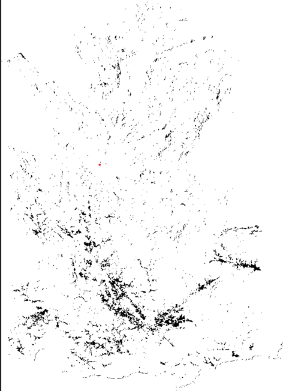
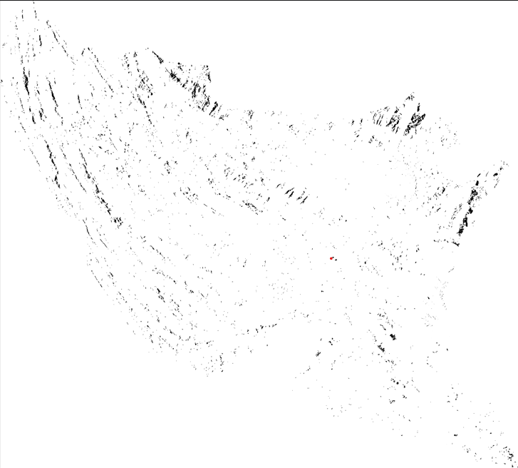

# 🌊 SAR-Based Flood Extent Detection using Sentinel-1, ESA SNAP & QGIS

A geospatial flood mapping workflow that detects flood inundation from **Sentinel-1 Synthetic Aperture Radar (SAR)** imagery using **ESA SNAP**, **Python**, and **QGIS**. The pipeline preprocesses SAR imagery, extracts flood regions, removes permanent water bodies using OpenStreetMap, and exports GIS-ready raster and vector products for visualization and analysis.

---

## 📌 Overview

Flooded surfaces appear as **low-backscatter (dark)** regions in Sentinel-1 SAR imagery. This project automates the complete workflow from SAR preprocessing to flood extent extraction.

The workflow includes:

- Sentinel-1 SAR preprocessing in ESA SNAP
- Flood detection using radar backscatter thresholding
- Speckle noise removal
- Permanent water body masking
- Flood polygon generation
- Flood extent visualization
- GIS-ready raster and vector export

---

# Workflow

```text
Sentinel-1 GRD
        │
        ▼
Apply Orbit File
        │
        ▼
Radiometric Calibration
        │
        ▼
Speckle Filtering
        │
        ▼
Terrain Correction
        │
        ▼
GeoTIFF Export
        │
        ▼
Python Flood Detection Pipeline
        │
        ├── Sigma0 → dB Conversion
        ├── Thresholding
        ├── Morphological Cleanup
        ├── Permanent Water Removal
        ├── Polygon Extraction
        └── Flood Area Estimation
        │
        ▼
Flood Maps + GeoTIFF + GeoJSON
```

---

# Study Areas

Flood mapping has currently been performed for the following districts of Sri Lanka:

- Gampaha
- Kalutara
- Matara
- Ratnapura

---

# Data Sources

- **Sentinel-1 GRD SAR Imagery**
- **Copernicus Open Access Hub**
- **OpenStreetMap** (Permanent Water Bodies)
- **ESA SNAP**

---

# SNAP Preprocessing

The SAR imagery is first processed in **ESA SNAP** using the standard Sentinel-1 workflow.

1. Apply Orbit File
2. Radiometric Calibration
3. Speckle Filtering
4. Range-Doppler Terrain Correction
5. Export as GeoTIFF

The output is a terrain-corrected Sigma0 GeoTIFF ready for flood extraction.

---

# Flood Detection Pipeline

The Python notebook performs the following processing steps:

| Step | Description |
|------|-------------|
| 1 | Load Sentinel-1 GeoTIFF |
| 2 | Convert Sigma0 to dB |
| 3 | Threshold low-backscatter pixels |
| 4 | Morphological noise removal |
| 5 | Remove rivers, lakes and reservoirs using OpenStreetMap |
| 6 | Polygonize flood regions |
| 7 | Compute flooded area |
| 8 | Export raster and vector outputs |

Notebook:

```
Flood_Detection_Pipeline_CLEAN.ipynb
```

---

# Outputs

The pipeline generates the following products.

| File | Description |
|------|-------------|
| Flood_Final.tif | Binary Flood Mask |
| Flood_QGIS_Overlay.tif | Transparent QGIS Overlay |
| Flood_Visual_RGBA.tif | RGBA Flood Visualization |
| Flood_Extent_Vector.geojson | Flood Polygon Layer |
| Flood_Map_Satellite.html | Interactive Flood Map |
| Flood_Overlay_Satellite.png | Satellite Overlay |

---

# Current Repository Structure

```
QGIS-Flood
│
├── Flood_Detection_Pipeline_CLEAN.ipynb
├── README.md
│
└── Result
    ├── Gamapaha_2024-05-23.tif
    ├── Kaluthra_2024-05-23.tif
    ├── matara_2024-05-23.tif
    ├── ratnapur-2024-05-23.tif
    ├── _matara_2021-05-15.tif
    │
    ├── gamapaha.png
    ├── Kaluthra.png
    ├── matara.png
    └── ratnapura.png
```

---

# 📊 Results

The repository currently contains flood extent maps generated for four study areas. The PNG files below are visualization previews, while the accompanying GeoTIFF files contain the full GIS-ready raster outputs.

## Gampaha



---

## Kalutara



---

## Matara



---

## Ratnapura



---

## Current Output Preview

**The figures above represent the current outputs generated by the flood detection pipeline.**

Each visualization is produced from the processed Sentinel-1 SAR imagery after:

- SAR preprocessing
- Backscatter thresholding
- Morphological filtering
- Permanent water removal
- Flood polygon generation

Future improvements will include:

- Multi-date flood comparison
- Accuracy assessment against reference datasets
- Automatic threshold selection
- Flood statistics dashboard
- Change detection between pre- and post-flood events

---

# Installation

Install the required Python libraries.

```bash
pip install rasterio geopandas shapely scikit-image scipy osmnx contextily folium
```

---

# Running the Project

1. Download Sentinel-1 GRD imagery.
2. Preprocess the SAR image in ESA SNAP.
3. Export the corrected GeoTIFF.
4. Open `Flood_Detection_Pipeline_CLEAN.ipynb`.
5. Set the input GeoTIFF path.
6. Run the notebook.
7. Export flood maps and GIS layers.

---

# Technologies Used

- Sentinel-1 SAR
- ESA SNAP
- Python
- QGIS
- Rasterio
- GeoPandas
- OSMnx
- Folium
- Scikit-image
- Shapely
- Contextily

---

# Limitations

- Threshold values are scene dependent.
- OpenStreetMap water coverage may be incomplete in some regions.
- SAR shadows and smooth urban surfaces may introduce false positives.
- Results should be validated using reference flood datasets before operational deployment.

---

# Future Work

- Automatic threshold optimization
- Machine Learning based flood segmentation
- Time-series flood monitoring
- Flood severity estimation
- Interactive web dashboard
- Cloud deployment for large-scale processing

---

# Author

**Aditya Singh**

B.E. Computer Science  
BITS Pilani

---

## ⭐ If you found this project useful, consider giving the repository a star.
